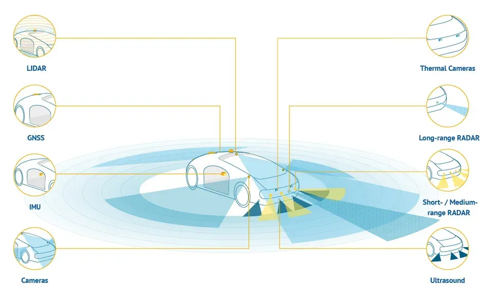
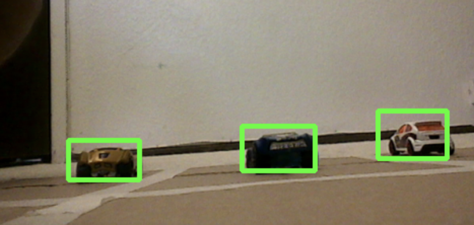

# SensorFusion

For autonomous vehicles it is imperative that there are multiple ways to check for obstacles and vehicles in the surroundings because the consequences if one of the methods fail can be devestating. Sensor fusion is a term that describes merging different sensors in order to have failsafes in case one method fails and also to corroborate information from multiple sensors to have greater accuracy when detecting and determining obstacles.

In our method we use computer vision to visually identify obstacles. We also use an ultrasonic, infrared, and light sensor with an arduino to corroborate the information and obtacles that the camera sees. This is an example of what the camera sees with toy cars.

